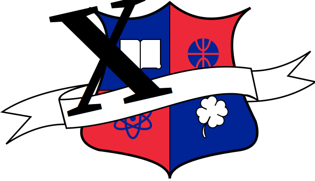
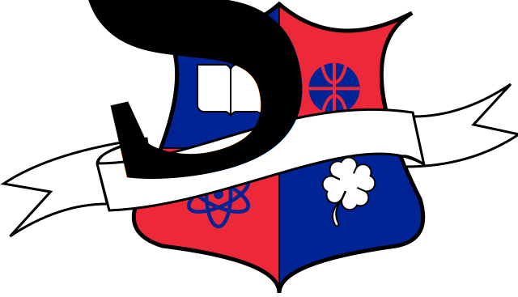

= Logo dla Zespołu Szkół Ogólnokształcących nr 2 im. Charles de Gaulle'a
:toc:
:toclevels: 3
:toc-title: 

Projekt logo dla https://zso2.pl[Zespołu Szkół Ogólnokształcących nr 2 im. Charles de Gaulle'a]

== ZSO 2

=== Barwy Francji

==== ZSO 2

==== XVI LO

==== SP 56

==== Przedszkole nr 85

=== Błękitno-czerwone

==== ZSO 2

image::logo-zso2.svg[]
image::logo-zso2-poznan.svg[]

==== XVI LO

image::logo-zso2-XVILO.svg[]

==== SP 56

image::logo-zso2-SP56.svg[]

==== Przedszkole nr 85

image::logo-zso2-przedszkole85.svg[]